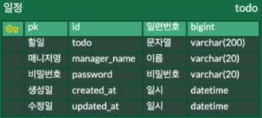
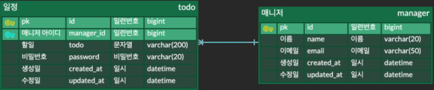

# 필수 구현 API 명세서

| Function | Method | URI                 | Request                                                           | Response                                                                                                                       | Status Code                           |
|----------|--------|---------------------|-------------------------------------------------------------------|--------------------------------------------------------------------------------------------------------------------------------|---------------------------------------|
| 일정 작성    | POST   | /api/todos          | {"todo": "string", "managerName": "string", "password": "string"} | {"id": 1, "todo": "string", "managerName": "string", "createdAt": "2024-08-10T00:00:00", "updatedAt": "2024-08-10T00:00:00"}   | 200: OK                               |
| 일정 조회    | GET    | /api/todos/{todoId} | -                                                                 | {"id": 1, "todo": "string", "managerName": "string", "createdAt": "2024-08-10T00:00:00", "updatedAt": "2024-08-10T00:00:00"}   | 200: OK 500: Internal Server Error |
| 일정 목록 조회 | GET    | /api/todos          | ?date=YYYY-MM-DD&managerName=string                               | [{"id": 1, "todo": "string", "managerName": "string", "createdAt": "2024-08-10T00:00:00", "updatedAt": "2024-08-10T00:00:00"}] | 200: OK                               |
| 일정 수정    | PUT    | /api/todos/{todoId} | {"todo": "string", "managerName": "string", "password": "string"} | {"id": 1, "todo": "string", "managerName": "string", "createdAt": "2024-08-10T00:00:00", "updatedAt": "2024-08-10T00:00:00"}   | 200: OK 500: Internal Server Error |
| 일정 삭제    | DELETE | /api/todos/{todoId} | { "password": "string" }                                          | -                                                                                                                              | 200: OK 500: Internal Server Error |

# 필수 구현 ERD

# 추가 구현 API 명세서

| Function | Method | URI                 | Request                                                  | Response                                                                                                                                                                       | Status Code                                      |
|----------|--------|---------------------|----------------------------------------------------------|--------------------------------------------------------------------------------------------------------------------------------------------------------------------------------|--------------------------------------------------|
| 일정 작성    | POST   | /api/todos          | {"todo": "string", "managerId": 1, "password": "string"} | {"id": 1, "todo": "string", "managerId": 1, "managerName": "string", "managerEmail": "string@a.com", "createdAt": "2024-08-10T00:00:00", "updatedAt": "2024-08-10T00:00:00"}   | 200: OK                                          |
| 일정 조회    | GET    | /api/todos/{todoId} | -                                                        | {"id": 1, "todo": "string", "managerName": "string", "createdAt": "2024-08-10T00:00:00", "updatedAt": "2024-08-10T00:00:00"}                                                   | 200: OK 400: Bad Request                      |
| 일정 목록 조회 | GET    | /api/todos          | ?date=YYYY-MM-DD&managerName=string                      | [{"id": 1, "todo": "string", "managerId": 1, "managerName": "string", "managerEmail": "string@a.com", "createdAt": "2024-08-10T00:00:00", "updatedAt": "2024-08-10T00:00:00"}] | 200: OK                                          |
| 일정 수정    | PUT    | /api/todos/{todoId} | {"todo": "string", "managerId": 1, "password": "string"} | {"id": 1, "todo": "string", "managerId": 1, "managerName": "string", "managerEmail": "string@a.com", "createdAt": "2024-08-10T00:00:00", "updatedAt": "2024-08-10T00:00:00"}   | 200: OK 400: Bad Request 403: Unauthorized |
| 일정 삭제    | DELETE | /api/todos/{todoId} | { "password": "string" }                                 | -                                                                                                                                                                              | 200: OK 400: Bad Request 403: Unauthorized |

# 추가 구현 ERD
